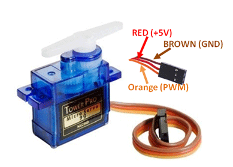

# Servo

Motor Servo adalah jenis Aktuator elektromekanis yang tidak berputar secara kontinu seperti motor DC atau motor stepper. Motor servo digunakan untuk posisi dan memegang beberapa objek. Motor jenis ini digunakan dimana rotasi kontinu tidak diperlukan sehingga tidak digunakan untuk mengendalikan roda (kecuali servo ini dimodifikasi). Sebaliknya, motor servo digunakan dimana sesuatu yang dibutuhkan pindah ke posisi tertentu dan kemudian berhenti dan bertahan pada posisi itu.



## Contoh penggunaan:


```cpp
#include <Servo.h>

Servo myservo;  // buat objek servo

int pos = 0;    // varibel untuk menyimpan posisi servo

void setup() {
  // set nomor pin yang digunakan
  // - arduino: 9
  // - esp32: 13
  // - esp8266: 2 (D4)
  myservo.attach(9); 
}

void loop() {
  for (pos = 0; pos <= 180; pos += 1) { // geser dari 1 sampai 180
    // geser 1 derajat
    myservo.write(pos);              // instruksikan servo untuk bergerak ke posisi 'pos'
    delay(15);                       // tunggu 15ms untuk servo bergerak ke posisi yang ditentukan
  }
  for (pos = 180; pos >= 0; pos -= 1) { // geser dari 180 ke 1
    myservo.write(pos);              // instruksikan servo untuk bergerak ke posisi 'pos'
    delay(15);                       // tunggu 15ms untuk servo bergerak ke posisi yang ditentukan
  }
}
```