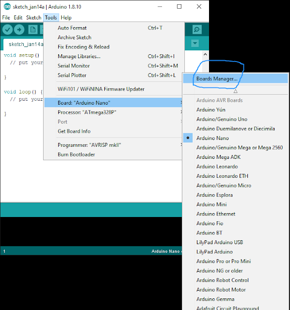
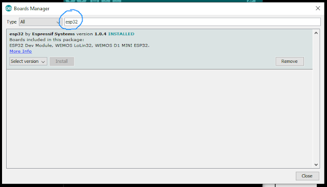
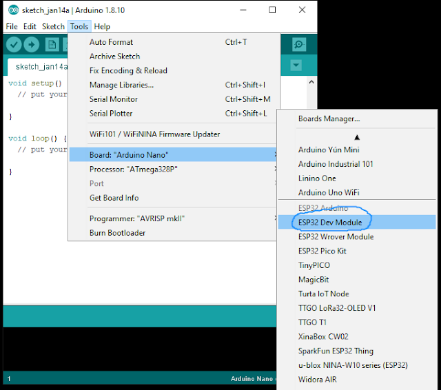
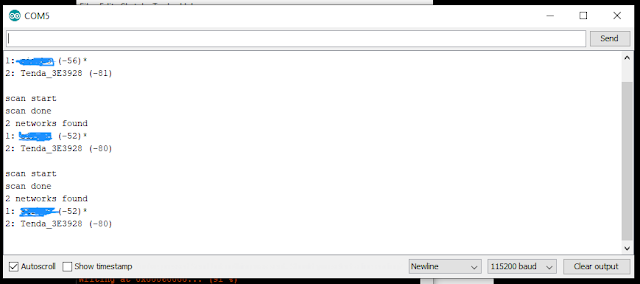

# Setup ESP32 di Arduino IDE

Jika Anda menggunakan perangkat ESP32, Anda bisa menggunakan Arduino IDE untuk upload program. Ikuti langkah-langkah berikuti supaya Arduino IDE bisa mengenali ESP32.

1. Buka Arduino IDE, kemudian klik Menu `File > Preferences`
   
   

   Pada kolom _Additional, tambahkan link berikut:
   ```
   https://dl.espressif.com/dl/package_esp32_index.json
   ```

2. Klik menu `Tools > Board: > Boards Manager ...`

   

3. Pada kolom pencarian tulis ESP32 kemudian install dan tunggu sampai selesai

   

4. Install telah selesai. Kemudian kita test.
   
   Klik menu `Tools > Board: > ESP32 DEV Module`

   

5. Pilih socket COM:

   

6. Buka example dengan klik menu `File > Example > WiFi > WiFiScan`

   

7. Setelah tampil, kemudian kita klik tombol upload (arah kanan). Tunggu hingga selesai compilenya. Jika sudah muncul tulisan "Conecting ... " pada keterangan dibawah, tekan dan tahan tombol "boot" pada hardware ESP32 yang berada pada sebelah kiri port usb.

   

8. Hingga ada tulisan "Leaving..." maka tombol boot boleh dilepas.

   

   Setelah itu maka akan ada pemberitahuan "Done Uploading"


9. Selesai Upload, kita buka Serial monitor yang ada disebelah kanan atas. Maka akan muncul tulisan seperti berikut:

   

sumber:
https://www.robotikindonesia.com/2020/01/cara-menggunakan-esp32-di-arduino-ide.html