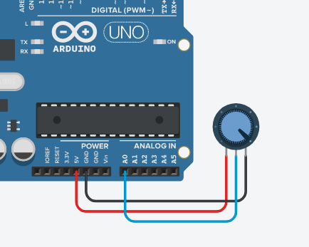

# Tinkercad

Tinkercad adalah suatu situs pembelajaran, yang menyediakan materi dan program untuk pembelajaran 3D Design, Elektronika dan mikrokontroler, dan pemrograman. Selama perkuliahan ini kita akan menggunakan Tinkercad untuk melakukan simulasi, jadi silahkan mendaftar di situs ini di [www.tinkercad.com](https://tinkercad.com)


---


Setelah Anda berhasil masuk, ada beberapa hal yang Anda perlu perhatian di halaman utama.
1. **Join Class**\
   Class akan dibuat untuk perkuliahan ini. Pastikan Anda mendapatkan _kode kelas_ untuk bisa bergabung.
2. **Classes**\
   **Classes** di panel sebelah kiri akan menampilkan class Tinkercad yang Anda ikuti.
3. **Design**\
   Menampilkan design yang pernah Anda buat.
4. **Tutorial**\
   Menampilkan tutorial yang pernah Anda ikuti. Tutorial adalah materi pembelajaran yang disediakan oleh Tinkercad yang bisa Anda ikuti. Memulai tutorial dilakukan lewat menu (di sebelah atas) _Resources - Tips & Tricks_
5. **Gallery**\
   Melihat contoh project yang dibuat orang lain. Gallery akan terbagi menjadi 3 bagian: 3D Designs, Circuits, Codeblocks.
6. **Projects**\
   Ide dan panduan untuk project DIY yang Anda bisa lakukan.


## Memulai Circuit
Ada 3 pembelajaran yang kita bisa lakukan di Tinkercad (3D Design, Circuits, Codeblocks), tapi dalam perkuliahan ini kita hanya fokus mempelajari _Circuits_. Untuk memulai:
1. klik _Design_ di panel kiri
2. klik `+` di kanan halaman, kemudian pilih _Circuits_

## Mengenal _Basic Components_
Setelah Anda memulai project _Circuits_ baru, Anda akan menemukan _Basic Components_ di sebelah kanan halaman, masing-masing bisa digunakan untuk mensimulasi komponen elektronik.
- **Resistor**: komponen resistor. Besarannya bisa ditentukan sesuai kebutuhan.
- **LED**: komponen lampu LED. Warnanya bisa ditentukan sesuai kebutuhan.
- **Pushbutton**: komponen tombol
- **Potentiometer**: komponen potensio meter. 
- **Capasitor**: komponen kapasitor
- **Slideswitch**: komponen switch on/off.
- **9V Battery**: komponen baterai 9V seperti baterai "kotak"
- **Coin Cell 3V Battery**: komponen baterai litium/kancing 3V
- **1.5V Battery**: komponen baterai 1.5V seperti baterai AAA

### Potentionmeter
Potensiometer bisa digunakan sebagai media input. Input dari potensiometer dibaca lewat `analogRead()`. Nilai yang dihasilkan dari potentiometer ini adalah 0-1023.

Potentiometer memiliki 3 kaki:
1. Terminal 1: untuk dihubungkan ke sumber listrik 5V
2. Wiper: untuk dihubungkan ke GND
3. Terminal 2: untuk dihubungkan ke input pin.

Berikut contoh membaca input menggunakan potentiometer dan menampilkan output lewat _Serial Monitor_. Ketika potentiometer diputar full ke kiri, maka `analogRead()` akan memberikan nilai 0, nilai 1023 jika diputas full ke kanan.


```cpp
void setup()
{
   pinMode(0,INPUT);
  	Serial.begin(9600);
}

void loop()
{
  int x = analogRead(0);  
  Serial.println(x);
}
```
